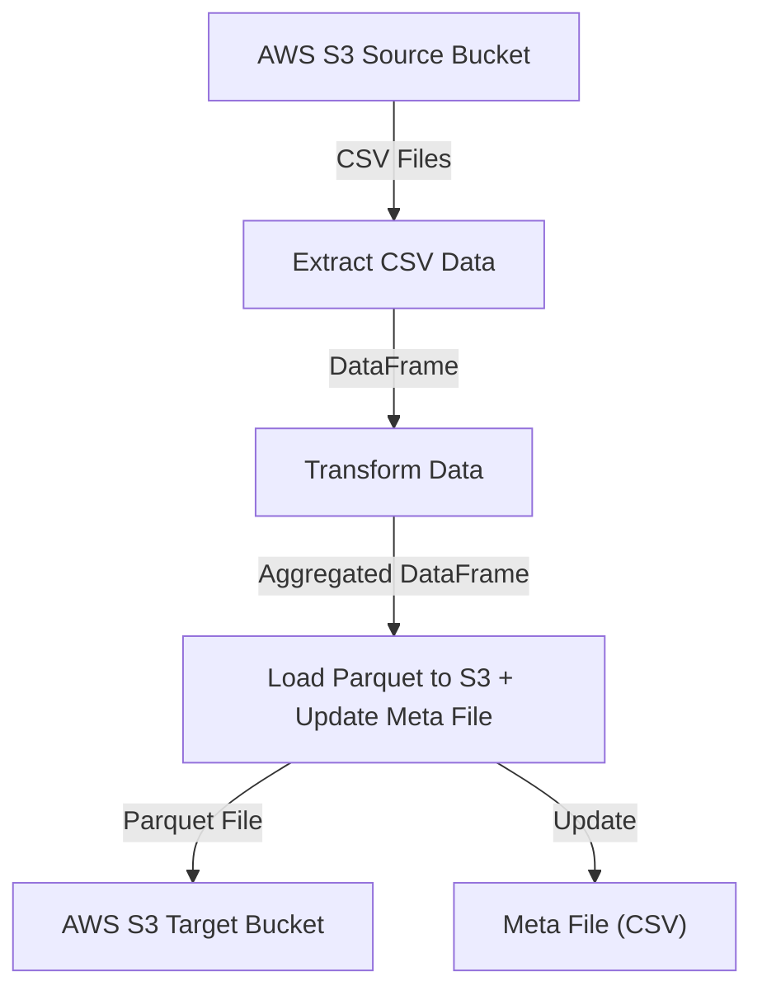
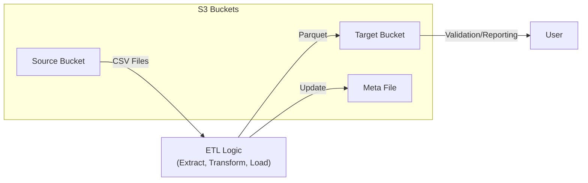

# AWS S3 Xetra Analysis & Testing Suite Documentation

This documentation describes a set of scripts and tests for an AWS S3-based ETL pipeline aimed at processing Xetra trading data. The codebase covers everything from data extraction, transformation, and loading (ETL), to extensive automated testing for robust data engineering and integration with AWS S3.

---

## aws_s3_xetra_analysis.ipynb

This Jupyter notebook implements a full ETL workflow for Xetra data using AWS S3 as the data source and sink. It includes utility functions for S3 I/O, transformation logic, meta file management, and an integrated orchestration with reporting and validation.

### Key Features

- **Adapter Layer Functions:** S3 bucket interaction for reading, writing, and listing files.
- **Application Layer Functions:** Extraction, transformation, and loading (ETL) routines for Xetra trading data.
- **Meta File Management:** Handles processed dates using a meta file for incremental data processing.
- **End-to-End Orchestration:** `main()` function as a pipeline entry point.
- **Validation:** Run and check uploaded files and data in S3.

---

### S3 Adapter Layer

Handles direct interaction with S3 buckets for reading and writing data.

```python
def read_to_csv_df(bucket, key, columns=None, sep=',', decoding='utf-8'):
    csv_obj = bucket.Object(key=key).get().get('Body').read().decode(decoding)
    data = StringIO(csv_obj)
    df = pd.read_csv(data, delimiter=sep)
    if columns:
        df = df[columns]
    return df 

def write_df_to_s3(df, key, bucket):
    out_buffer = BytesIO()
    df.to_parquet(out_buffer, index=False)
    bucket.put_object(Body=out_buffer.getvalue(), Key=key)
    return True

def write_df_to_s3_csv(bucket, df, key):
    out_buffer = StringIO()
    df.to_csv(out_buffer, index=False)
    bucket.put_object(Body=out_buffer.getvalue(), Key=key)
    return True

def list_filter_in_prefix(bucket, prefix):
    files = [obj.key for obj in bucket.objects.filter(Prefix=prefix)]
    return files 
```

---

### Application Layer

Defines business logic for data extraction, transformation, and loading.

#### Extraction

Extracts and concatenates CSV files from S3 for specified dates.

```python
def extrack(date_list, bucket):
    files=[key for date in date_list for key in list_filter_in_prefix(bucket, date)]
    df = pd.concat([read_to_csv_df(bucket, obj) for obj in files], ignore_index=True)
    return df
```

#### Transformation

Cleans and aggregates Xetra data, calculates opening/closing prices, and computes daily changes.

```python
def Transfor(df, arg_date, columns):
    df['opening_price'] = df.sort_values('Date').groupby(['ISIN','Date'])['StartPrice'].transform('first')
    df['closing_price'] = df.sort_values('Date').groupby(['ISIN','Date'])['EndPrice'].transform('first')
    df = df.groupby(['ISIN','Date'], as_index=False).agg(
        opening_price_eur=('opening_price','min'),
        closing_price_eur=('closing_price','min'),
        MaxPrice_eur=('MaxPrice','max'),
        MinPrice_eur=('MinPrice','min'),
        TradedVolume=('TradedVolume','sum')
    )
    df['prev_closing_price'] = df.sort_values(by=['Date']).groupby(['ISIN'])['closing_price_eur'].shift(1)
    df['change_prev_closing_%'] = (df['closing_price_eur'] - df['prev_closing_price'])/df['prev_closing_price']*100
    df.drop(columns='prev_closing_price', inplace=True)
    df = df.round(decimals=2)
    df = df[df.Date >= arg_date]
    return df
```

#### Loading

Writes the transformed data and updates the meta file.

```python
def load(trg_key, bucket, trg_format, df, meta_key, extract_date_list, scr_format):
    key = trg_key + datetime.today().strftime('%Y%m%d_%H%M%S') + trg_format
    write_df_to_s3(df, key, bucket)
    meta_file_update(bucket, meta_key, extract_date_list, scr_format)
    return True
```

---

### Meta File Management

Maintains which dates have been processed.

```python
def retrun_date_list(bucket, arg_date, scr_format, meta_key):
    min_date = datetime.strptime(arg_date, scr_format).date() - timedelta(days=1)
    today = datetime.today().date()
    try:
        df_meta = read_to_csv_df(bucket, meta_key)
        # ... computes missing dates ...
        # returns min_date, list of dates to process
    except bucket.session.client('s3').execptions.NoSuchKey:
        # ... fallback logic ...
        pass
```

```python
def meta_file_update(bucket, meta_key, extract_date_list, scr_format):
    df_new = pd.DataFrame(columns=['source_date','datetime_of_processing'])
    df_new['source_date'] = extract_date_list
    df_new['datetime_of_processing'] = datetime.today().strftime(scr_format)
    df_old = read_to_csv_df(bucket, meta_key)
    df_all = pd.concat([df_old, df_new])
    write_df_to_s3_csv(bucket, df_all, meta_key)
```

---

### ETL Orchestration

Main function to orchestrate the flow:

```python
def main():
    # Parameters/Configurations
    arg_date = '2022-01-27'
    scr_format='%Y-%m-%d'
    meta_key='Meta_File.csv'
    scr_bucket='fezi-xetra-123'
    trg_bucket='fezi-xetra'
    columns=['ISIN', 'Date', 'Time', 'StartPrice', 'MaxPrice', 'MinPrice','EndPrice','TradedVolume']
    key='xetra_daily_report'+ datetime.today().strftime('%Y%m%d_%H%M%S')+'.parquet'
    trg_format='.parquet'
    trg_key='xetra_daily_report' 
    # Init
    s3 = boto3.resource('s3')
    bucket_src = s3.Bucket(scr_bucket)
    bucket_trg = s3.Bucket(trg_bucket)
    # run application
    extract_date, date_list = retrun_date_list(bucket_trg, arg_date, scr_format, meta_key)
    etl_report1(bucket_src, bucket_trg, extract_date, date_list, columns, trg_key, trg_format, meta_key)
```

---

### Example Output Table

The transformed report contains:

| ISIN         | Date       | opening_price_eur | closing_price_eur | MaxPrice_eur | MinPrice_eur | TradedVolume | change_prev_closing_% |
|--------------|------------|-------------------|-------------------|--------------|--------------|--------------|----------------------|
| AT000000STR1 | 2022-01-27 | 37.90             | 37.90             | 37.90        | 37.00        | 485          | 1.34                 |
| ...          | ...        | ...               | ...               | ...          | ...          | ...          | ...                  |

---

#### ETL Pipeline Flow



---

## test_int_xetra_transformer.py

This integration test verifies the end-to-end ETL process for Xetra trading data using mocked AWS S3 buckets. It ensures the ETL pipeline produces accurate reports and properly updates the meta file.

### Key Features

- **Mocked S3 Setup:** Uses `boto3` and test buckets in the 'eu-central-1' region.
- **ETL Configuration:** Sets up source and target configs for column mappings and file naming.
- **Source Data Preparation:** Uploads test CSV data to the mock source bucket.
- **Full ETL Run:** Executes the `etl_report1()` method and validates both the report and the meta file.
- **Meta File Integrity:** Asserts that the meta file contains the correct processed dates.

### Main Test Structure

```python
def test_etl_report(self):
    # Setup expected results
    # Execute ETL
    # Read generated report and meta file from S3
    # Assert meta file's processed dates
```

#### Test Data Example

| ISIN         | Date       | opening_price_eur | closing_price_eur | ... |
|--------------|------------|-------------------|-------------------|-----|
| AT0000A0E9W5 | 2022-12-25 | ...               | ...               | ... |

---

## test_meta_file.py

This suite tests the meta file logic, which is crucial for incremental and idempotent ETL processing.

### Key Features

- **Meta File Update:** Tests adding new dates, handling empty input, and merging with existing data.
- **Meta File Schema Validation:** Fails gracefully on malformed meta files.
- **Return Date List Logic:** Ensures the pipeline computes the correct set of dates to process, both with and without an existing meta file.

### Test Cases

- **test_update_meta_file_on_meta_file:** Writes new meta entries and checks them.
- **test_update_meta_file_empty_data_list:** Expects a log and no file on empty input.
- **test_update_meta_file_meta_file_ok:** Merges new and old dates correctly.
- **test_update_meta_file_meta_file_wrong:** Raises exception on schema mismatch.
- **test_return_date_list_no_meta_file:** Returns all dates if meta file absent.
- **test_return_date_list_meta_file_ok:** Handles partial meta coverage.
- **test_return_date_list_meta_file_wrong:** Fails on malformed meta.
- **test_return_date_list_empty_date_list:** Returns empty on no missing dates.

---

## test_s3.py

This module tests the custom S3 connector, verifying robust I/O and error handling for the pipeline.

### Key Features

- **Reading CSV Files:** Validates reading and DataFrame output.
- **Writing DataFrames:** Tests both CSV and Parquet output formats.
- **Empty DataFrame Handling:** Skips writing empty DataFrames.
- **Wrong Format Handling:** Raises exception on unsupported formats.
- **Listing Files:** Ensures correct listing and empty results for missing prefixes.

### Sample Test

```python
def test_write_df_to_s3_parquet(self):
    # Write DataFrame to S3 as parquet
    # Read back and compare for equality
```

---

## test_xetra_transformation.py

This module performs detailed unit tests on each ETL stage: extract, transform, and load.

### Key Features

- **Mocked S3 Environment:** Uses Moto for AWS mocking.
- **Extraction Tests:** Checks for correct DataFrame assembly from S3.
- **Transformation Tests:** Validates output structure and logic, including edge cases (empty data).
- **Loading and Meta File:** Ensures correct output and meta file updates.
- **End-to-End Test:** Executes the full ETL and asserts correctness.

### Notable Test Cases

- **test_extract_no_file:** Checks behavior with no source files found.
- **test_extract_files:** Validates correct extraction for known source data.
- **test_transform_report1_emptydf:** Ensures transform skips on empty DataFrame.
- **test_transfor_report1_ok:** Confirms correct transformation.
- **test_load:** Checks writing Parquet and meta updates.
- **test_etl_report:** Full pipeline validation.

---

## \_\_init\_\_.py

This file is empty. Its sole purpose is to mark its directory as a Python package.

---

# Summary Table

| File Name                    | Purpose                                              |
|------------------------------|-----------------------------------------------------|
| aws_s3_xetra_analysis.ipynb  | Main ETL pipeline: S3 extraction, transform, load   |
| test_int_xetra_transformer.py| Integration test: End-to-end ETL + meta validation  |
| test_meta_file.py            | Unit tests: Meta file logic and schema              |
| test_s3.py                   | Unit tests: S3 connector for I/O and errors         |
| test_xetra_transformation.py | Unit tests: ETL extraction, transformation, loading |
| __init__.py                  | Python package marker (empty)                       |

---

# 🎯 Key Takeaways

- **Separation of Concerns:** Adapter and application layers keep I/O and business logic distinct.
- **Meta File:** Provides robust, reproducible incremental processing.
- **Test Coverage:** End-to-end and unit tests ensure reliability and correctness.
- **AWS S3 Integration:** All data movement is via S3, suitable for scalable cloud pipelines.

---

> **Tip:** This modular, well-tested approach is ideal for production ETL/data engineering workloads on AWS.

---

# 🛠️ Extending the System

To enhance this pipeline:
- Add data validation or quality checks in the transformation phase.
- Use AWS Lambda or Step Functions to orchestrate as a serverless pipeline.
- Expand meta file logic for more granular or multi-source tracking.

---

# 🖼️ Visual Overview



---

**This concludes the detailed documentation for the AWS S3 Xetra ETL and testing suite.**